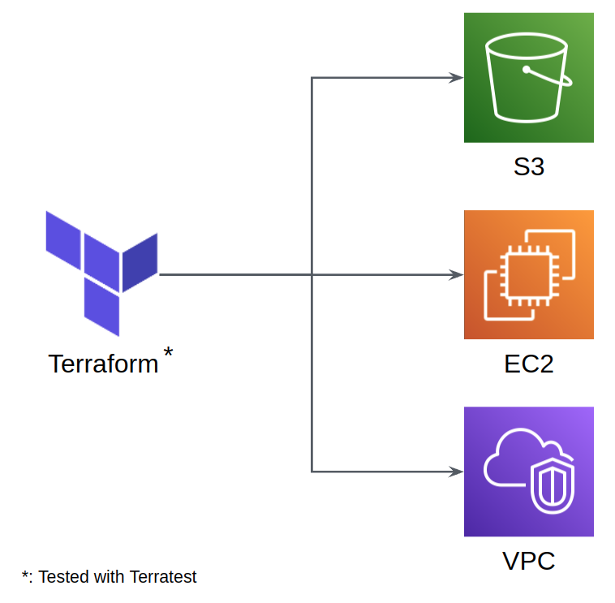

# terraform-terratest

## About the project

This is a project for deploying resources in AWS using the following stack:
- Terraform
- Terratest
- Github Actions

It is responsible for creating VPC, S3 bucket, EC2 instance.



## Project tree

```
├── docs                    # Contains assets for documenting the project
├── infrastructure          # Contains all the manifests written in Terraform
└── tests                   # Contains all the tests used to validate the Terraform manifests
```

## Architecture

### 1) VPC
A VPC was created to serve as network for every EC2 instance and ALB deploy in this project. It has three subnets (all public) and each one was deployed in a different availability zone. 

### 2) S3
A dummy s3 bucket that blocks all public access to it was created.

### 3) EC2
Three EC2s were created in this project: one as a dummy and two used as a target group for hosting a webapp.

### 4) ALB
An application load balancer was created to balance HTTP traffic (using round-robin algorithm) into the EC2 target group.

### 5) Static Webapp
A simple webapp was developed using FastAPI to serve a static HTML page when accessing the route `/`. It was also created a health check endpoint (in path `/health`) to be used as a health check route for the target group.

### 6) Custom AMI
A custom AMI was created for installing the static webapp. The application was installed and run every time the OS boots since it was installed as a service (systemd). Hashicorp Packer was used to automatically create this AMI.

### Extra:
All the infrastructure was tested using Terratest.

## Workflow

There is a single workflow in this project. It is responsible for: 
- Create AMI using Packer
- Run tests made with Terratest
- Run terraform-docs action to automatically create documentation